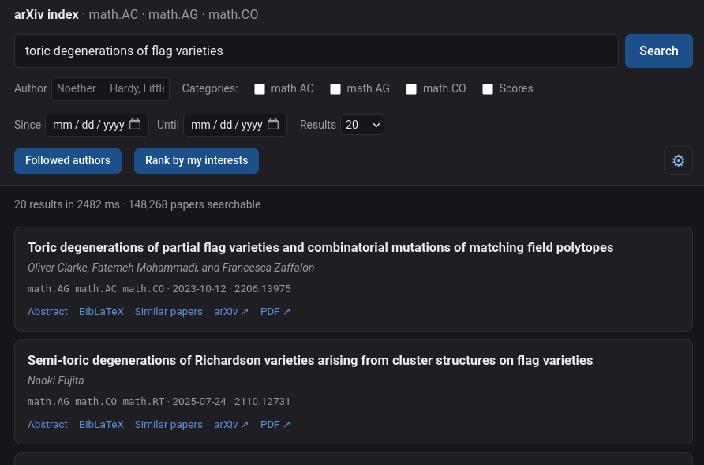

<h1 align="center"></h1>

A personalized search engine for arXiv, running entirely on your own machine.
It looks up papers by meaning: describe what you are looking for in your own
words and it finds the papers closest to your description, whether or not they
use the same terms. It also helps you stay up to date on the research relevant
to you. Describe your interests and it finds the papers closest to your work.
Keep a list of researchers you follow, and never miss one of their papers.



## First-time setup

The repository is **code only**. A fresh clone can search nothing until you
build the index, which takes one large download and a few hours of embedding.
After that, keeping it current takes about a minute a week.

**1. Install Ollama and the embedding model.** Ollama runs the model that
turns text into vectors. Install it from [ollama.com](https://ollama.com), make
sure it is running (`ollama serve`, or the service its installer sets up), and
fetch the model, about 2.5 GB:

```bash
ollama pull qwen3-embedding:4b
```

To use a different model, pull it too; setting up asks which to use. An index
keeps its model for good.

**2. Get the code**, with Python 3.11 or newer, and either install it or run it
from where it is:

```bash
git clone https://github.com/MattDupraz/arxiv_index.git

# Either install it, which gives an `arxiv_index` command usable anywhere:
pip install ./arxiv_index

# Or run it without installing: only its two dependencies are installed, and
# every command is run from the repository, as `python3 -m arxiv_index`:
pip install numpy ollama
cd arxiv_index
python3 -m arxiv_index --help
```

This README writes commands as `arxiv_index build`, `arxiv_index serve` and so
on. Without installing, each is `python3 -m arxiv_index build`,
`python3 -m arxiv_index serve`, and so on, run from the repository directory:
`python3 -m` finds the code there, and only there. To work on the code,
`pip install -e ./arxiv_index` gives the command while keeping edits live.

Embedding runs in Ollama, on the GPU if Ollama can use one; nothing else needs
a GPU.

**3. Get the papers**, from one of two sources:

- **arXiv's metadata snapshot**, to build the index yourself. arXiv's API
  cannot page back far enough to fetch the whole history, so the index is first
  filled from Kaggle's copy of arXiv's metadata:
  [kaggle.com/datasets/Cornell-University/arxiv](https://www.kaggle.com/datasets/Cornell-University/arxiv)
  (a free Kaggle account is needed). Unzip it anywhere; the file inside,
  `arxiv-metadata-oai-snapshot.json`, is about 5.5 GB. It is needed only to
  set up and can be deleted afterwards, though adding a category later needs
  it again.
- **An index exported by another instance** (see
  [Exporting and importing](#exporting-and-importing-an-index)), which comes
  with its embeddings and so skips the hours of embedding.

**4. Set up the index**, in the browser or in a terminal.

### In the browser

```bash
arxiv_index serve     # opens http://127.0.0.1:8000/
```

While the index is empty, the page that opens is a first-time setup, which
asks first how to fill the index:

- **Build it from arXiv's snapshot.** Choose the categories to cover, by their
  full names (`math.AG`, `hep-th`, `cs.LG`; see the
  [list](https://arxiv.org/category_taxonomy); the default is math.AC, math.AG
  and math.CO), the embedding model, from those installed in Ollama, and the
  snapshot file, and whether to embed the papers straight away.
- **Import an exported index.** Choose the export, and nothing else: its
  embedding model and categories come with it, and so do its followed authors
  and interests if it was exported with its settings.

The page shows the progress. Keep the tab open until the file has been read, a
minute or two for the snapshot. The embedding that follows runs on the server,
about three hours for the default three categories on a consumer GPU, and the
index can be opened and searched while it works. When it is done, **Open the
index**, then under the cog (top right): **Fetch new papers** brings it up to
date from the snapshot's date, and the same panel holds the authors you follow,
your research interests (see [Your profile](#your-profile)) and
[automatic updates](#automatic-updates).

The setup page is only offered on the machine running `serve`.

### Or in a terminal

From the snapshot:

```bash
arxiv_index build ~/Downloads/arxiv-metadata-oai-snapshot.json
arxiv_index update    # catch up from the snapshot's date to today
arxiv_index status    # what is in the index, and up to when
arxiv_index serve
```

`build` first asks which categories to cover and which embedding model to use,
from those installed in Ollama. The answers are saved in
`~/.arxiv_index/config.json`, where the categories can be changed later (see
[Adding a category](#adding-a-category)). With no one at the terminal it takes
the defaults.

It then scans the snapshot for those categories, which takes a couple of
minutes, and embeds every paper: about three hours for the default three
categories' 145,000 papers on a consumer GPU, proportionally longer for more.
It can be interrupted at any time, and `arxiv_index build --embed-only` carries
on where it stopped. The index takes about 6.3 KB of disk per paper, in
`~/.arxiv_index/`.

To embed at a better time, say overnight, add `--scan-only`: it imports the
papers and stops. Embed them later with `build --embed-only`, or with
**Embed them now** in the web UI, shown beside the count of papers not yet
embedded. Until then they can be listed by author but not found by searches.
The next `update` embeds them too, and so does **Fetch new papers**, so either
of those can start the long run.

From an export, which takes its model and categories from the file:

```bash
arxiv_index import arxiv_index.tar    # --settings takes its profile too
arxiv_index update
arxiv_index serve
```

In the web UI, open the settings (the cog, top right) to add the authors you
follow and describe your research interests (see [Your profile](#your-profile)),
and to have the index [update itself](#automatic-updates) while the server
runs.

## Settings

The index and everything personal live in `~/.arxiv_index/`, or wherever
`$ARXIV_INDEX_DIR` points. The personal part is one file, `config.json`, so
handing someone `papers.db` and `vectors.f16` does not hand them your profile.

```json
{
  "categories": ["math.AC", "math.AG", "math.CO", "math.NT"]
}
```

| | |
|---|---|
| `categories` | the arXiv categories you want, by their full names: `math.AG`, `hep-th`, `cs.LG` ([list](https://arxiv.org/category_taxonomy)). Default: math.AC, math.AG, math.CO |
| `embedding` | the Ollama embedding model. Default: `qwen3-embedding:4b`; see [below](#another-embedding-model) |

The profile and the automatic-update setting are stored here too, written by
the web UI. Hand edits are picked up without a restart, except the two keys
above, which `serve` reads once; categories changed in the web UI, under the
cog, apply at once.

### Another embedding model

The setup page offers every embedding model installed in Ollama and fills this
in for you. By hand:

```json
"embedding": {
  "model": "nomic-embed-text",
  "dim": 768,
  "query_prefix": "search_query: ",
  "document_prefix": "search_document: "
}
```

`dim` is the model's embedding length (`ollama show <model>` gives it). The
prefixes are whatever the model's card says it was trained with, and default
to none. All the measurements in `config.py` were taken with the default model.

An index is tied to the model that built it. `model`, `dim` and
`document_prefix` are recorded in it, and anything else is refused, since those
vectors would not be comparable. To switch models, point `$ARXIV_INDEX_DIR` at
a new directory and `build` there. `query_prefix` is free to change at any
time.

### Adding a category

In the web UI, add it under **Categories** in the settings (the cog) and save;
it applies at once. **Import from the arXiv snapshot** below it then offers the new
category: choose the snapshot there to fill it in. In a terminal, add it to
`categories` in the settings file and run `build` with the snapshot's path.

Either way the snapshot is scanned **for the new categories only**, leaving
papers already held alone, and the next update fills in everything since the
snapshot was taken. Until then, `status` and the web UI list it as not yet in
the index. A name that matches no papers in the snapshot is reported, since it
is most likely a typo.

### Removing a category

Removing a category, under **Categories** in the web UI or from the settings
file, hides it rather than deleting it. With no category ticked, searches cover
**your** categories only. The index still
holds the dropped one (as it does the categories of an index someone copied to
you), and `update` keeps every category it holds current.

### Exporting and importing an index

An index, embeddings included, can be written to one file and installed
elsewhere, to back it up or to spare another machine the build:

```bash
arxiv_index export arxiv_index.tar    # about 6.3 KB per paper
arxiv_index import arxiv_index.tar    # on the other machine
```

The file holds the papers and their embeddings. With `export --settings` it
also holds your settings file (categories, followed authors, interests, the
update schedule) and the cached embeddings of your interests, so another
machine can be set up as a copy of this one. `import --settings` takes them up
in place of the settings there, which are kept as `config.json.bak`; without
it they are left out. Merging with `--settings` keeps your categories as well
as the export's. Settings naming a different embedding model from the
index's are refused.

Into an empty index, a fresh install, the export brings its embedding model
and the categories it holds, and your settings are updated to match; if that
model is not installed in Ollama, the import says to pull it. Into an index
that has papers, an export built with a different embedding model from the one
your settings name is refused, and it needs one of:

| | |
|---|---|
| `--merge` | add the export's papers to this index. A paper in both keeps the more recent copy (the later arXiv version, then the later date), with its embedding. A category in both is complete up to the later of the two dates, and the export's categories are added to yours, so none is hidden. Nothing needs embedding again |
| `--replace` | discard this index and install the export in its place |

A running `serve` picks up the result within a few seconds, as it does any
change to the index. After importing, `update` brings the index up to date,
and `build` adds any of your categories it does not hold. A merge that
replaced papers leaves their old vectors unused; `compact` reclaims the space.

### From the web UI

Under the cog, **Import and export** does the same without a terminal:

| | |
|---|---|
| **Import from the arXiv snapshot** | only for a category just added under **Categories**: pick `arxiv-metadata-oai-snapshot.json` to fill in its history, which **Fetch new papers** cannot reach, like `build`, and optionally embed it. Off while every category is in the index |
| **Import an exported index** | pick an export to merge into this index or replace it, like `import`; tick **and its settings** to take those up too |
| **Export this index** | downloads an export, like `export`; tick **with your settings** to include them |

The file is streamed between the browser and the server, never held whole, and
progress shows under the settings. An import's upload needs the tab open until
it has been read, a minute or two for the snapshot; the embedding or merge that
follows carries on without it. The section is only shown, and the server only
accepts these requests, when the page is opened on the machine running `serve`.

### The two index files are a matched set

`papers.db` is the source of truth: each paper's `row` column names its
slot in `vectors.f16`, which has no identity of its own. **Back them up
together**, or use `export`, which does. If they are separated, the vectors
can be rebuilt:

```bash
sqlite3 ~/.arxiv_index/papers.db "UPDATE papers SET row = NULL"
rm ~/.arxiv_index/vectors.f16
arxiv_index build --embed-only
```

The reverse does not work: `vectors.f16` alone is anonymous numbers.

## Using it

The web UI has a search box, an author filter, category checkboxes, a date
range, expandable abstracts, a **BibLaTeX** button and **Similar papers** on
every result. LaTeX is rendered with a vendored KaTeX, so it works offline. The
cog opens settings: your profile, a **Fetch new papers** button, when to run
that automatically, and, on the machine running the server, importing and
exporting.

```bash
arxiv_index search "toric degenerations of flag varieties"
arxiv_index search "chromatic polynomial" -k 20 --category math.CO
arxiv_index search "invariant theory of finite groups" --author Noether
arxiv_index search --author "Hardy, Littlewood"  # no query needed
arxiv_index similar 0704.0002
```

**Scores are hidden by default** in both interfaces. The **Scores** checkbox and
`--scores` reveal them.

### Your profile

Two fields describing *you* rather than a search, filled in under the cog and
stored in your [settings file](#settings):

| | |
|---|---|
| **Followed authors** | one name per line — people worth reading whatever they write |
| **Research interests** | one short description per thing you work on, each with a weight |

They drive two buttons, both over the **Since**/**Until** range, which is used
exactly as the form has it. Leave both empty to ask the whole index.

**Followed authors** lists everything those people posted in the range,
newest-first. This is a *union* — the opposite of the author box, where several
names mean papers written **together**.

**Rank by my interests** orders the same range by closeness to what you work on.
Only embedded papers can be ranked.

Write one interest per project rather than one paragraph: each is embedded
**separately**, so they stay distinct instead of averaging into a point that is
squarely none of them. Each carries a weight from `0` to `2` (default `1`);
`0` parks an entry without deleting it.

A paper is scored against every interest, the scores are multiplied by their
weights and sorted, and each after the first counts less — the first in full,
the second times *b*, the third times *b²*. The **Reward for matching several**
slider is *b*:

| *b* | what it does |
|---|---|
| `0` | only the best match counts. A paper squarely on one project wins outright |
| `0.35` | the default. The best match dominates, but a genuine second match still lifts a paper |
| `1` | every match counts in full, which ranks identically to averaging your interests into one vector |

Descriptions are embedded on save, so changing a weight or the slider embeds
nothing. If Ollama is unreachable the text is stored anyway and flagged as
unrankable until you save again. An interest added by editing the settings
file is embedded the first time you rank. The embeddings are cached in
`interest-vectors.json` in the same directory, which is safe to delete.

### Searching by author

Works alone — newest-first for that author — or alongside a query, which ranks
their work by relevance to it.

**Several names, comma-separated, mean papers written *together*.** `Hardy,
Littlewood` returns their 8 joint papers rather than the 197 written by one or
the other; `;` and `and` also separate. A single name written surname-first
works too, and does better than `Godfrey Hardy`, since the terms match
independently and so also find "Godfrey H. Hardy".

**Names match regardless of case and accents**, since arXiv stores many author
fields as LaTeX (`Poincar\'e`, `Erd\H{o}s`). Affiliations riding along in the
field are stripped.

One asymmetry: **with** a query only embedded papers come back, since ranking
needs a vector. **Without** one, the listing is pure metadata and covers every
paper in the database.

## Keeping it current

```bash
arxiv_index update
```

or the **Fetch new papers** button, which runs exactly this. It walks the arXiv
API back from the newest paper to the stored cursor, embeds what is new, and
advances the cursor. Papers whose title or abstract changed are re-embedded. The
cursor advances *only* when a walk provably reached it: a run cut short says
`WALK INCOMPLETE`, keeps what it fetched and leaves the cursor alone, so the
failure mode is wasted work rather than a gap.

Embedding takes an exclusive lock (`embed.lock` in the index directory), so an
`update` firing during a long `build` exits cleanly. Searching during a build
is fine: a running `serve` checks the index every few seconds and picks up
whatever changed, whether from a `build`, `update`, `import` or `compact` run
in a terminal or by cron, so it never needs restarting for the index's sake.

From the web UI the run belongs to the server rather than the tab, so closing
the page does not stop it and reopening picks it back up. One runs at a time.

### Automatic updates

Under the cog, **Automatic updates** presses the button on a clock for as long
as `serve` is up, so an index does not go stale behind a server left running:

| | |
|---|---|
| **Off** | the default |
| **Every N hours** | measured from when the last run started, 1 to 168 |
| **Daily at HH:MM** | a wall-clock time to the quarter hour, in the server machine's **local** time |

Local rather than UTC on purpose: 07:00 means 07:00 where you are, and arXiv's
announcements go out at a fixed New York time.

**A missed run is caught up, not skipped.** A daily 07:00 run on a machine
asleep until 09:00 fires at 09:00. Switching the setting on works the same way:
if a slot has passed and nothing has run since, the first run happens within the
minute. Manual runs count, so **Fetch new papers** resets the clock.

Set it and press its **Save**; it takes effect within 30 seconds, no restart
needed. For updates without a server running, use cron, giving the command's
full path (`which arxiv_index`) if cron's `PATH` does not reach it:

```cron
0 7 * * 1  arxiv_index update >> ~/.arxiv_index/update.log 2>&1
```

Without installing, run it from the repository instead:

```cron
0 7 * * 1  cd /path/to/arxiv_index && python3 -m arxiv_index update >> ~/.arxiv_index/update.log 2>&1
```

## Commands

`arxiv_index <command>`, or `python3 -m arxiv_index <command>` from the
repository without installing; every command takes `--help`.

| | |
|---|---|
| `build [SNAPSHOT]` | backfill from the snapshot, then embed. `--scan-only` stops before embedding, `--embed-only` skips the scan |
| `update` | fetch and embed what is new from the arXiv API |
| `search` | semantic search; `--author`, `--category`, `--since`, `--scores`, `--full`, `--json` |
| `similar` | neighbours of a given arXiv id |
| `serve` | the web UI; `--port`, `--host`, `--no-browser` |
| `status` | settings file, index location, model, counts, and per category how far it is complete |
| `config` | show your settings file, creating it with the defaults if absent |
| `compact` | reclaim vector slots left behind by re-embedded papers |
| `export FILE` | write the index, embeddings included, to one file; `--settings` adds your settings |
| `import FILE` | install an exported index; `--merge` adds it to the one here, `--replace` overwrites it, `--settings` takes up its settings |

`serve` binds to `127.0.0.1` by default. The server exposes the index and,
indirectly, Ollama, so think before changing `--host`.

## Source layout

How the index is built is in `config.py`, with the measurements behind each
choice in the comments; what differs between people is in the settings file.
Deeper background — why search is brute-force, what was tried and abandoned
— is in [NOTES.md](NOTES.md).

| | |
|---|---|
| `config.py` | models, tuning |
| `settings.py` | the per-person settings file: categories, model, profile |
| `store.py` | SQLite schema + append-only vector file |
| `embedder.py` | Ollama embedding calls with retry |
| `ingest.py` | snapshot scan + the resumable embedding loop |
| `update.py` | incremental fetch from the arXiv API |
| `search.py` | exact cosine search, author filtering |
| `textnorm.py` | LaTeX author names, folded for matching |
| `cite.py` | biblatex entries |
| `transfer.py` | exporting and importing an index |
| `profile.py` | followed authors + weighted interests, each with its own embedding |
| `schedule.py` | when the server tops itself up |
| `web.py` | the web server (stdlib `http.server`) |
| `static/` | the web pages: `index.html` and `setup.html`, their CSS and JS, and a vendored KaTeX |
| `__main__.py` | CLI |
